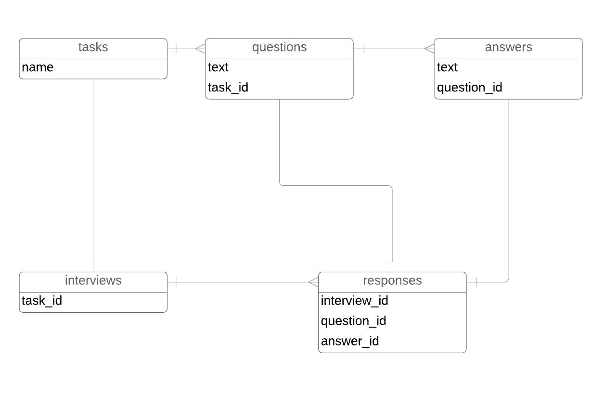

# Rails Interview Project

This repository contains a simple rails application that we use for interviews at HomeStars.

Instead of a using a generic blog or todo list type of an application we want to work on
a concept that relates to HomeStars' products and can be accomplished in a interview setting.

## Setup

1. Clone this repository.
2. To ensure everything is set up correctly, run:   
    1. `bundle install` 
    2. `rails test` or `rails spec` 
       (depending on what you prefer minitest or rspec. Both available for you to choose.)

## Intro

This app is an API for serving-up/capturing interview questions as part of homeowner submitting a `Service Request`
to our application. Homeowners submit a `Service Request` based on a task ("Air Ducts & Vents - Clean", "Tree Trimming")

An `Interview` is a completed set of responses. A response joins a question and the answer selected by the homeowner.

This app uses jsonapi-rb to serialize JSON responses. You can find an example of a simple GET endpoint in the
`TasksController`, and you can find the related serializer in the `app/serializable` directory.

## Tooling

* [JSON-API](https://jsonapi.org/) is a convention for writing JSON endpoints.
* [jsonapi-rb-rails](http://jsonapi-rb.org/guides/getting_started/rails.html) is a library for 
  serializing ActiveRecord objects and their relationships according to the JSON-API specs.
